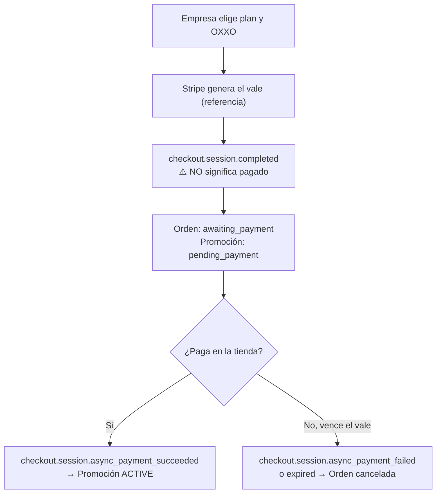

# Impulso Jobs — Localización para México

> La plataforma opera en **México**. Este documento **corrige y reemplaza** los supuestos previos basados en Colombia (NIT, IVA 19 %, DIAN, PSE, COP) y recoge todo lo que cambia en el producto, el modelo de datos y el backlog.

> **Estado (agosto 2026): aplicado en lo ya construido.** RFC/CURP validados (`common/utils/mx-identifiers.ts` + `shared/validators/mx-identifiers.validator.ts`); estados, municipios, regímenes fiscales SAT y usos de CFDI como constantes en `common/catalogs/` y `shared/catalogs/mx.catalogs.ts`; ubicación por estado/municipio y C.P. en empresas, perfiles y vacantes; soft delete en `users` para ARCO.
> **ARCO ya está implementado (M13):** Acceso → `GET /account/data-export` · Rectificación → endpoints de perfil (M6/M9) · Cancelación → `DELETE /account` (baja lógica + purga tras retención, `ACCOUNT_RETENTION_DAYS`) · Oposición → visibilidad del perfil (M8).
> **Pendiente:** todo lo ligado a pagos y facturación (§2, §3, §5) — depende del módulo de billing. Falta también publicar el **aviso de privacidad**.

---

## 1. Resumen de cambios (Colombia ➜ México)

| Aspecto | Supuesto anterior (CO) | **Correcto para México** |
|---|---|---|
| Moneda | COP | **MXN** (peso mexicano) |
| IVA | 19 % | **16 %** |
| Identificador fiscal de empresa | NIT | **RFC** (12 caracteres persona moral / 13 persona física) |
| Facturación electrónica | DIAN | **CFDI 4.0 · SAT** (con PAC autorizado) |
| Identificación de personas | Cédula (CC/CE) | **CURP** (18), **RFC**, **INE/IFE**, pasaporte |
| División territorial | Departamentos | **Estados** (32) y **municipios/alcaldías** |
| Código postal | — | **C.P.** de 5 dígitos |
| Pasarela | Stripe (no opera en CO) | **Stripe opera oficialmente en México** ✅ |
| Métodos de pago locales | PSE (no soportado por Stripe) | **OXXO**, **SPEI**, **Meses Sin Intereses**, tarjetas |
| Ley de datos | Habeas Data (Ley 1581) | **LFPDPPP** (aviso de privacidad, derechos ARCO) |
| Zona horaria | America/Bogotá | **America/Mexico_City** |
| Locale | es-CO | **es-MX** |

> **La buena noticia:** desaparece el bloqueo principal. Stripe **sí está disponible para empresas mexicanas**, sin necesidad de constituir una entidad en el extranjero.

---

## 2. Pagos: lo que México habilita (y sus reglas)

Stripe México soporta tarjetas y, además, tres métodos que cambian el diseño:

### 2.1. OXXO (pago en efectivo) — **crítico**
Es un método por **vale/comprobante**: el usuario elige OXXO, recibe un vale con referencia, y **paga en efectivo en una tienda OXXO**. Representa **más del 30 % de las transacciones en México**, y en un mercado con baja bancarización es indispensable para B2B pequeño.

**Restricciones que afectan directamente al diseño:**

| Regla de OXXO | Impacto en Impulso Jobs |
|---|---|
| **Solo pagos únicos** — *no admite planes recurrentes de suscripción* | **Media y Alta** ✅ pueden pagarse con OXXO. El **plan Anual** ❌ **no** puede cobrarse por OXXO → requiere tarjeta o SPEI. |
| **Monto mínimo MXN 10 · máximo MXN 10,000** por vale | Si el precio de **Alta** supera los $10,000 MXN, **no** podrá pagarse con OXXO. **Condiciona la política de precios.** |
| **Pago diferido**: la confirmación llega al siguiente día hábil | La promoción **no se activa al instante**. Necesita un estado intermedio y comunicación clara al usuario. |
| **No admite reembolsos ni disputas** | Definir un proceso manual de devolución si hace falta. |
| Se puede fijar el vencimiento del vale (`expires_after_days`) | Sugerido: 2–3 días. Al vencer, se cancela la orden. |

### 2.2. SPEI (transferencia interbancaria)
Transferencia electrónica entre bancos mexicanos, muy usada en **B2B**. Stripe entrega una **cuenta virtual (CLABE)** a la que la empresa transfiere; la conciliación es automática. Buena opción para montos altos y para la **suscripción anual**.

### 2.3. Meses Sin Intereses (MSI)
Permite a la empresa **diferir el pago en cuotas mensuales** (hasta 24) con tarjeta de crédito mexicana. Aumenta la conversión en tickets altos (plan Anual). Requiere moneda **MXN** y tarjeta emitida en México; **tiene un costo adicional** sobre la comisión estándar (varía según el número de meses).

### 2.4. Recomendación de métodos por plan

| Plan | Tarjeta | OXXO | SPEI | MSI |
|---|:--:|:--:|:--:|:--:|
| **Media** (pago único) | ✅ | ✅ *(si ≤ $10,000)* | ✅ | ➖ |
| **Alta** (pago único) | ✅ | ✅ *(si ≤ $10,000)* | ✅ | ✅ |
| **Anual** (suscripción) | ✅ | ❌ **no soporta recurrente** | ✅ | ✅ |

---

## 3. Impacto técnico en el flujo de pago

**El cambio más importante:** con OXXO/SPEI el pago es **asíncrono**. El usuario sale del checkout **sin haber pagado**.



**Consecuencias concretas:**
1. **`checkout.session.completed` NO equivale a pago recibido** cuando el método es OXXO/SPEI. Hay que manejar **`checkout.session.async_payment_succeeded`** y **`checkout.session.async_payment_failed`**.
2. Nuevo estado en `promotion_orders`: **`awaiting_payment`** (vale generado, aún sin pagar), distinto de `pending` y de `paid`.
3. La UI debe mostrarle a la empresa el **vale/referencia** y explicar que la vacante se promocionará **cuando se confirme el pago** (siguiente día hábil).
4. Notificar por correo cuando el pago se confirme (o cuando el vale venza).

---

## 4. Cambios en el modelo de datos

```text
companies
  - tax_id (NIT)        →  rfc                     (12/13 caracteres, único, validar formato)
  + legal_name                                     (razón social, para el CFDI)
  + tax_regime                                     (régimen fiscal SAT, requerido en CFDI 4.0)
  + cfdi_use                                       (uso del CFDI: G03 gastos en general, etc.)
  + postal_code                                    (C.P., requerido en CFDI 4.0)
  - state (departamento) →  state                  (catálogo de 32 estados)
  + municipality                                   (municipio / alcaldía)

candidate_profiles
  - document_type (CC/CE) → document_type          (catálogo: CURP | RFC | INE | Pasaporte)
  + curp                                           (18 caracteres, opcional/único)

promotion_orders
  + payment_method            (card | oxxo | spei | msi)
  + payment_status            (+ nuevo estado: awaiting_payment)
  + voucher_url               (URL del vale OXXO)
  + voucher_reference         (número de referencia)
  + voucher_expires_at
  + installments              (nº de meses, para MSI)

plans
  currency = 'MXN'  ·  tax_rate = 0.16
```

**Catálogos a sembrar:** 32 **estados** de México (y sus municipios), **regímenes fiscales SAT**, **usos de CFDI**, y tipos de documento mexicanos.

---

## 5. Facturación electrónica (CFDI / SAT)

Stripe **no emite CFDI**. Toda venta a una empresa mexicana requiere factura fiscal timbrada ante el SAT a través de un **PAC** (proveedor autorizado de certificación).

- Necesitas integrar un **PAC** (p. ej. Facturama, Facturapi, SW Sapien) o un ERP que lo haga.
- Datos obligatorios del receptor en **CFDI 4.0**: **RFC**, **razón social exacta**, **régimen fiscal** y **código postal**. Si no coinciden con el SAT, el timbrado falla → hay que capturarlos y validarlos en el perfil de empresa.
- Flujo sugerido: pago confirmado (webhook) → generar CFDI vía PAC → guardar UUID fiscal en `promotion_orders` → enviar PDF/XML a la empresa.
- **Nuevo módulo:** `modules/billing/invoicing/` con un puerto `InvoicingPort` + adaptador del PAC (mismo patrón que `PaymentProvider`).

---

## 6. Otros ajustes de producto

- **Textos y locale:** `es-MX`. Cuidado con los términos: en México se dice **"vacante"**, "postulación"/"aplicación", "currículum" o "CV" (más que "hoja de vida"), **"sueldo"** (más que "salario"), y las ubicaciones son **Estado + Municipio/Alcaldía**.
- **Rangos salariales:** en **MXN**, mensual (convención local).
- **Teléfono:** formato +52, 10 dígitos.
- **Privacidad:** la **LFPDPPP** exige **aviso de privacidad** explícito y soporte a los **derechos ARCO** (Acceso, Rectificación, Cancelación, Oposición) → alinear con el módulo de eliminar cuenta (M13) y la configuración de visibilidad (M8).
- **Zona horaria:** `America/Mexico_City` para vencimientos de vales, planes y crons.

---

## 7. Impacto en el backlog

| Tarea | Descripción | Est. |
|---|---|---|
| T‑105b | Catálogos MX: estados, municipios, regímenes fiscales SAT, usos de CFDI, tipos de documento | 6 h |
| T‑115b | Ajustar `companies` (RFC, régimen, C.P.) y `candidate_profiles` (CURP) + validaciones de formato | 5 h |
| T‑224d | Habilitar **OXXO y SPEI** en el adaptador de Stripe (vale, referencia, expiración) | 8 h |
| T‑225c | Manejar **pago asíncrono**: estado `awaiting_payment` + eventos `async_payment_*` + notificaciones | 10 h |
| T‑225d | **Meses Sin Intereses** (configuración de cuotas) | 5 h |
| T‑230 | **Facturación CFDI**: puerto `InvoicingPort` + adaptador PAC + timbrado post‑pago | 16 h |
| T‑231 | Aviso de privacidad + derechos ARCO (LFPDPPP) | 6 h |

> **~56 h adicionales.** El grueso es la facturación CFDI (obligatoria para vender a empresas en México) y el manejo del pago asíncrono de OXXO.

---

## 8. Decisiones pendientes (actualizadas)

1. **Precios en MXN** de Media, Alta y Anual. ⚠️ **Si Alta supera $10,000 MXN, no podrá pagarse con OXXO** — decide sabiendo esto.
2. **¿Se ofrece OXXO?** (recomendado: sí, es >30 % de las transacciones del país).
3. **¿Meses Sin Intereses** en el plan Anual? (sube conversión, pero tiene costo extra).
4. **PAC para el CFDI:** ¿cuál se integra? ¿Se factura automáticamente al pagar o a solicitud?
5. **IVA:** 16 % — ¿precio mostrado con IVA incluido o "+ IVA"? (en México lo habitual en B2B es "+ IVA").
6. Confirmar el alcance de la **suscripción Anual** (sigue pendiente del documento de planes).
