# Impulso Jobs — Modelo Entidad‑Relación (completo, unificado)

> Esquema completo de la plataforma en **un solo diagrama**. Nombres normalizados (ver notas al final).

```mermaid
erDiagram
    %% ===== Autenticación y RBAC =====
    users ||--o{ tokens_users : "posee"
    users ||--o{ blacklist_tokens : "invalida"
    users ||--o{ user_roles : "asignado"
    roles ||--o{ user_roles : "otorga"
    roles ||--o{ role_permissions : "agrupa"
    permissions ||--o{ role_permissions : "incluida"
    components ||--o{ permissions : "define"
    actions ||--o{ permissions : "define"
    users ||--o{ audit_logs : "genera"

    %% ===== Candidato =====
    users ||--o| candidate_profiles : "es"
    candidate_profiles ||--o{ candidate_experiences : "tiene"
    candidate_profiles ||--o{ candidate_educations : "cursa"
    candidate_profiles ||--o{ candidate_languages : "domina"
    languages ||--o{ candidate_languages : "referenciada"
    candidate_profiles ||--o{ candidate_skills : "posee"
    candidate_profiles ||--o{ candidate_resumes : "carga"
    candidate_profiles ||--o| candidate_profile_settings : "configura"

    %% ===== Empresa, Vacantes y Postulaciones =====
    users ||--o{ company_users : "vincula"
    companies ||--o{ company_users : "agrupa"
    companies ||--o{ vacancies : "publica"
    vacancies ||--o{ candidate_applications : "recibe"
    candidate_profiles ||--o{ candidate_applications : "realiza"
    candidate_resumes ||--o{ candidate_applications : "adjunta"
    application_status ||--o{ candidate_applications : "clasifica"
    candidate_applications ||--o{ application_status_history : "registra"

    %% ===== Monetización =====
    plans ||--o{ plan_feature_values : "define"
    plan_features ||--o{ plan_feature_values : "parametriza"
    plans ||--o{ vacancy_promotions : "aplica"
    companies ||--o{ vacancy_promotions : "compra"
    vacancies ||--o{ vacancy_promotions : "promociona"
    users ||--o{ vacancy_promotions : "adquiere"
    vacancy_promotions ||--o| promotion_orders : "factura"

    users {
        uuid id PK
        string email UK
        string password_hash
        boolean is_active
        boolean is_blocked
        int failed_attempts
        timestamp blocked_until
        timestamp last_login
        string last_login_ip
        string last_login_device
        timestamp email_verified_at
        smallint password_reset_attempts
        timestamp password_reset_window_start
        timestamp deleted_at
        timestamp created_at
        timestamp updated_at
    }
    tokens_users {
        uuid id PK
        uuid user_id FK
        text refresh_token
        string device
        string ip_address
        string user_agent
        boolean is_active
        timestamp created_at
        timestamp expires_at
    }
    blacklist_tokens {
        uuid id PK
        text token
        string token_type
        uuid user_id FK
        string reason
        timestamp invalidated_at
        timestamp expires_at
    }
    roles {
        smallint id PK
        string code UK
        string name
        string description
        timestamp created_at
    }
    permissions {
        int id PK
        smallint component_id FK
        smallint action_id FK
        string code UK
        string description
    }
    components {
        smallint id PK
        string code UK
        string name
    }
    actions {
        smallint id PK
        string code UK
        string name
    }
    role_permissions {
        smallint role_id FK
        int permission_id FK
    }
    user_roles {
        uuid user_id FK
        smallint role_id FK
    }
    audit_logs {
        uuid id PK
        uuid actor_user_id FK
        string action
        string entity
        string entity_id
        jsonb diff
        string ip_address
        string user_agent
        timestamp created_at
    }
    candidate_profiles {
        uuid id PK
        uuid user_id FK
        string first_name
        string last_name
        string document_type
        string document_number UK
        date birth_date
        string professional_title
        string summary
        string country
        string state
        string city
        string address
        string profile_photo_url
        string profile_visibility
        timestamp created_at
        timestamp updated_at
    }
    candidate_experiences {
        uuid id PK
        uuid candidate_profile_id FK
        string company_name
        string job_title
        string employment_type
        string country
        string state
        string city
        date start_date
        date end_date
        boolean is_current_job
        text responsibilities
        timestamp created_at
        timestamp updated_at
    }
    candidate_educations {
        uuid id PK
        uuid candidate_profile_id FK
        string institution_name
        string education_level
        string academic_program
        string degree_title
        string education_status
        date start_date
        date end_date
        boolean is_current_study
        timestamp created_at
        timestamp updated_at
    }
    candidate_languages {
        uuid id PK
        uuid candidate_profile_id FK
        smallint language_id FK
        string reading_level
        string writing_level
        string speaking_level
        boolean is_native
        timestamp created_at
        timestamp updated_at
    }
    languages {
        smallint id PK
        string name
        string iso_code UK
    }
    candidate_skills {
        uuid id PK
        uuid candidate_profile_id FK
        string name
        string level
        timestamp created_at
    }
    candidate_resumes {
        uuid id PK
        uuid candidate_profile_id FK
        string file_name
        string file_url
        int file_size
        string mime_type
        boolean is_default
        timestamp created_at
        timestamp updated_at
    }
    candidate_profile_settings {
        uuid id PK
        uuid candidate_profile_id FK
        string profile_visibility
        string information_visibility
        boolean is_immediately_available
        timestamp created_at
        timestamp updated_at
    }
    companies {
        uuid id PK
        string business_name
        string legal_name
        string tax_id UK
        string company_type
        string economic_sector
        string corporate_email
        string phone_number
        string website
        string country
        string state
        string city
        string address
        string company_description
        int employee_count
        int foundation_year
        string logo_url
        boolean is_active
        timestamp created_at
        timestamp updated_at
    }
    company_users {
        uuid id PK
        uuid company_id FK
        uuid user_id FK
        string company_role
        boolean is_active
        timestamp created_at
    }
    vacancies {
        uuid id PK
        uuid company_id FK
        string title
        text description
        text requirements
        string employment_type
        string work_mode
        string country
        string state
        string city
        string experience_level
        string salary_range
        date deadline
        string status
        timestamp published_at
        timestamp created_at
        timestamp updated_at
    }
    candidate_applications {
        uuid id PK
        uuid candidate_profile_id FK
        uuid vacancy_id FK
        uuid resume_id FK
        smallint application_status_id FK
        timestamp applied_at
        timestamp updated_at
    }
    application_status {
        smallint id PK
        string name
        string description
    }
    application_status_history {
        uuid id PK
        uuid application_id FK
        smallint previous_status_id FK
        smallint current_status_id FK
        uuid changed_by FK
        timestamp changed_at
    }
    plans {
        smallint id PK
        string code UK
        string name
        string tagline
        numeric base_price
        string currency
        boolean tax_included
        numeric tax_rate
        int duration_days
        boolean is_popular
        boolean is_active
        smallint sort_order
        timestamp created_at
        timestamp updated_at
    }
    plan_features {
        smallint id PK
        string code UK
        string name
        string value_type
        smallint sort_order
    }
    plan_feature_values {
        smallint plan_id FK
        smallint feature_id FK
        boolean is_included
        string value
    }
    vacancy_promotions {
        uuid id PK
        uuid vacancy_id FK
        smallint plan_id FK
        uuid company_id FK
        uuid purchased_by FK
        string status
        numeric price_paid
        string currency
        timestamp starts_at
        timestamp ends_at
        timestamp created_at
        timestamp updated_at
    }
    promotion_orders {
        uuid id PK
        uuid promotion_id FK
        numeric subtotal
        numeric tax_amount
        numeric total
        string currency
        string payment_status
        string payment_provider
        string external_reference
        timestamp paid_at
        timestamp created_at
    }
```

---

## Catálogos (valores semilla)

- **roles.code:** `ADMIN`, `EMPLOYER`, `CANDIDATE`.
- **application_status.name:** En revisión · En proceso · Entrevista · Prueba técnica · Seleccionado · Rechazado · Finalizado.
- **vacancies.status:** `Activa` · `Pausada` · `Cerrada`.
- **languages:** catálogo con `iso_code` (es, en, pt, fr, …).
- **plan_features.value_type:** `boolean` · `percent` · `numeric` · `text`.
- **plans.code:** `ESSENTIAL` · `PRO` · `PREMIUM` (matriz de beneficios en `plan_feature_values`).
- **vacancy_promotions.status:** `pending_payment` · `active` · `expired` · `cancelled`.
- **promotion_orders.payment_status:** `pending` · `paid` · `failed` · `refunded`.

## Notas de diseño

- `users` es la raíz de identidad. Un candidato tiene 1 `candidate_profiles`; un usuario empresa se vincula a 1..N `companies` vía `company_users`.
- El rol de **plataforma** (ADMIN/EMPLOYER/CANDIDATE) vive en `user_roles` (fuente única para el guard de permisos). El `company_role` (OWNER/ADMIN) de `company_users` es un rol **dentro** de la empresa.
- `audit_logs` es genérica y transversal a todos los dominios.
- Catálogo de planes **parametrizable**: `plans` + `plan_features` + `plan_feature_values` permiten crear/editar planes y beneficios sin cambiar el esquema. La promoción es **por vacante** (`vacancy_promotions`), con su cobro en `promotion_orders`.
- Nombres normalizados respecto al documento original: `companies` unificado (`business_name`, `legal_name`, `tax_id`, `economic_sector`, `website`); hojas de vida referencian `candidate_profile_id`; el rol vive en RBAC (no en columna `users.role`). `users.deleted_at` habilita el soft delete.
- Cardinalidad Mermaid: `||--o{` uno‑a‑muchos · `||--o|` uno‑a‑uno · `PK`/`FK`/`UK` = primaria/foránea/único.
