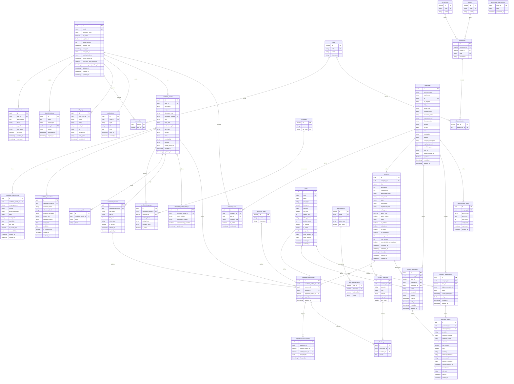

# Impulso Jobs — Modelo Entidad‑Relación (completo, México)

> Esquema completo: localización a México (RFC, CURP, estados/municipios, CFDI) y monetización con Stripe (planes por publicación + suscripción anual, cupos de visitas, preguntas de filtrado, notificaciones). Un solo diagrama unificado.

## Estado de implementación (agosto 2026)

El diagrama es el **objetivo**. Esto es lo que existe hoy en `backend/src/database/migrations/` (13 migraciones):

| Estado | Tablas |
|---|---|
| ✅ **Creadas** | `users` · `tokens_users` · `blacklist_tokens` · `roles` · `permissions` · `components` · `actions` · `role_permissions` · `user_roles` · `audit_logs` · `candidate_profiles` · `candidate_experiences` · `candidate_educations` · `candidate_languages` · `languages` · `candidate_skills` · `candidate_resumes` · `candidate_profile_settings` · `companies` · `company_users` · `vacancies` · `candidate_applications` · `application_status` · `application_status_history` · `talent_access_grants` · **`talent_access_views`** (nueva) · `plans` · `plan_features` · `plan_feature_values` · `vacancy_promotions` · `company_subscriptions` · `promotion_orders` · `processed_payment_events` |
| 🕓 **Pendientes** | `notifications` · `vacancy_questions` · `application_answers` |

**Convenciones reales del esquema** (aplican a *todas* las tablas de entidad, ver `common/entities/base.entity.ts`):

- `id` es **UUID v4 generado en la aplicación y almacenado como `varchar(36)`**, no un tipo `uuid` nativo — para que el mismo esquema corra en **PostgreSQL y MySQL** (`DB_TYPE`). Los catálogos usan `smallint`/`int` autoincremental.
- Toda entidad hereda `created_at`, `updated_at` y **`deleted_at` (soft delete)**, aunque el diagrama no lo repita en cada bloque.
- Las columnas `jsonb` del diagrama se declaran como `json`/`text` en las tablas ya creadas, por la misma portabilidad.

### Divergencias vigentes entre el diagrama y las tablas creadas

| Tabla | Diagrama | Implementado | Nota |
|---|---|---|---|
| `vacancies` | `salary_range` (string) | `salary_min`, `salary_max`, `salary_hidden` | El rango se guarda estructurado para poder filtrar y ordenar. |
| `vacancies` | — | `closed_at`, `can_edit_title_on_reactivate` | Añadidos por el flujo pausar/reactivar/cerrar. |
| `candidate_profiles` | `profile_visibility` | *(no existe aquí)* | La visibilidad vive **solo** en `candidate_profile_settings` (`profile_visibility` + `information_visibility`). |
| `companies` | `is_active` | *(no existe)* | La empresa no se desactiva; se gestiona por el estado de sus usuarios. |
| `application_status` | `id smallint PK`, `name`, `description` | `code varchar(30) PK`, `name`, `description`, `sort_order`, `is_final` | Catálogo con **código legible como PK**, igual que `languages`: el historial y las postulaciones se leen sin resolver ids. Se llena con `pnpm seed:applications`. |
| `candidate_applications` | `application_status_id smallint FK` | `status_code varchar(30)` | Consecuencia de lo anterior. |
| `candidate_applications` | — | `company_id` | Empresa de la vacante, copiada al postular: permite listar y contar por empresa sin join y conserva el vínculo al cerrarse la vacante. |
| `application_status_history` | `previous_status_id`, `current_status_id` | `previous_status_code`, `current_status_code` | Íd. `previous` es nulo sólo en la línea inicial. |
| `talent_access_views` | *(no existe en el ER)* | **tabla nueva** | Registra qué CV ya desbloqueó cada empresa (`company_id` + `candidate_profile_id`, único). Sin ella el cupo sería inservible: recargar la ficha gastaría otra visita. **La primera consulta cobra; las siguientes son gratis para siempre.** |
| `processed_stripe_events` | tabla propia de Stripe | **`processed_payment_events`** con PK compuesta (`provider` + `event_id`) | El cobro pasa por `PaymentProviderPort`, así que la idempotencia no puede llamarse por el nombre de un proveedor. |
| `companies.stripe_customer_id` | íd. | **`payment_customer_id`** | Misma razón. |
| `plans`, `vacancy_promotions`, `company_subscriptions` | `stripe_product_id`/`stripe_price_id`/`stripe_subscription_id` | `provider_product_id` / `provider_price_id` / `provider_subscription_id` | Misma razón. Nulos con el adaptador manual. |
| `plan_features` | `id smallint PK` | `code varchar(60) PK` | Tercer catálogo con código legible como PK, igual que `application_status` y `languages`. |
| `talent_access_grants` | `source_type`, `source_id` | íd. + `MANUAL` como origen | Además de promoción y suscripción, un administrador puede otorgar visitas a mano (cortesía/soporte). `total_visits = -1` significa ilimitado. |

> Los bloques del diagrama de abajo reflejan el objetivo; para el detalle exacto de lo ya creado, la fuente de verdad son las entidades y migraciones del backend.

```mermaid
erDiagram
    %% ===== Autenticación y RBAC =====
    users ||--o{ tokens_users : "posee"
    users ||--o{ blacklist_tokens : "invalida"
    users ||--o{ user_roles : "asignado"
    roles ||--o{ user_roles : "otorga"
    roles ||--o{ role_permissions : "agrupa"
    permissions ||--o{ role_permissions : "incluida"
    components ||--o{ permissions : "define"
    actions ||--o{ permissions : "define"
    users ||--o{ audit_logs : "genera"
    users ||--o{ notifications : "recibe"

    %% ===== Candidato =====
    users ||--o| candidate_profiles : "es"
    candidate_profiles ||--o{ candidate_experiences : "tiene"
    candidate_profiles ||--o{ candidate_educations : "cursa"
    candidate_profiles ||--o{ candidate_languages : "domina"
    languages ||--o{ candidate_languages : "referenciada"
    candidate_profiles ||--o{ candidate_skills : "posee"
    candidate_profiles ||--o{ candidate_resumes : "carga"
    candidate_profiles ||--o| candidate_profile_settings : "configura"

    %% ===== Empresa / Vacantes / Postulaciones =====
    users ||--o{ company_users : "vincula"
    companies ||--o{ company_users : "agrupa"
    companies ||--o{ vacancies : "publica"
    vacancies ||--o{ vacancy_questions : "filtra"
    vacancies ||--o{ candidate_applications : "recibe"
    candidate_profiles ||--o{ candidate_applications : "realiza"
    candidate_resumes ||--o{ candidate_applications : "adjunta"
    application_status ||--o{ candidate_applications : "clasifica"
    candidate_applications ||--o{ application_status_history : "registra"
    candidate_applications ||--o{ application_answers : "responde"
    vacancy_questions ||--o{ application_answers : "contesta"

    %% ===== Monetización (Stripe) =====
    plans ||--o{ plan_feature_values : "define"
    plan_features ||--o{ plan_feature_values : "parametriza"
    plans ||--o{ vacancy_promotions : "aplica"
    plans ||--o{ company_subscriptions : "suscribe"
    companies ||--o{ vacancy_promotions : "compra"
    companies ||--o{ company_subscriptions : "contrata"
    companies ||--o{ talent_access_grants : "recibe"
    vacancies ||--o{ vacancy_promotions : "promociona"
    vacancy_promotions ||--o| promotion_orders : "factura"
    company_subscriptions ||--o{ promotion_orders : "factura"

    users {
        uuid id PK
        string email UK
        string password_hash
        boolean is_active
        boolean is_blocked
        int failed_attempts
        timestamp blocked_until
        timestamp last_login
        string last_login_ip
        string last_login_device
        timestamp email_verified_at
        smallint password_reset_attempts
        timestamp password_reset_window_start
        timestamp deleted_at
        timestamp created_at
        timestamp updated_at
    }
    tokens_users {
        uuid id PK
        uuid user_id FK
        text refresh_token
        string device
        string ip_address
        string user_agent
        boolean is_active
        timestamp created_at
        timestamp expires_at
    }
    blacklist_tokens {
        uuid id PK
        text token
        string token_type
        uuid user_id FK
        string reason
        timestamp invalidated_at
        timestamp expires_at
    }
    roles {
        smallint id PK
        string code UK
        string name
        string description
    }
    permissions {
        int id PK
        smallint component_id FK
        smallint action_id FK
        string code UK
        string description
    }
    components {
        smallint id PK
        string code UK
        string name
    }
    actions {
        smallint id PK
        string code UK
        string name
    }
    role_permissions {
        smallint role_id FK
        int permission_id FK
    }
    user_roles {
        uuid user_id FK
        smallint role_id FK
    }
    audit_logs {
        uuid id PK
        uuid actor_user_id FK
        string action
        string entity
        string entity_id
        jsonb diff
        string ip_address
        string user_agent
        timestamp created_at
    }
    notifications {
        uuid id PK
        uuid user_id FK
        string type
        string title
        text body
        timestamp read_at
        timestamp created_at
    }
    candidate_profiles {
        uuid id PK
        uuid user_id FK
        string first_name
        string last_name
        string document_type
        string document_number UK
        string curp
        date birth_date
        string professional_title
        string summary
        string country
        string state
        string municipality
        string address
        string profile_photo_url
        timestamp created_at
        timestamp updated_at
    }
    candidate_experiences {
        uuid id PK
        uuid candidate_profile_id FK
        string company_name
        string job_title
        string employment_type
        string state
        string municipality
        date start_date
        date end_date
        boolean is_current_job
        text responsibilities
        timestamp created_at
        timestamp updated_at
    }
    candidate_educations {
        uuid id PK
        uuid candidate_profile_id FK
        string institution_name
        string education_level
        string academic_program
        string degree_title
        string education_status
        date start_date
        date end_date
        boolean is_current_study
        timestamp created_at
        timestamp updated_at
    }
    candidate_languages {
        uuid id PK
        uuid candidate_profile_id FK
        smallint language_id FK
        string reading_level
        string writing_level
        string speaking_level
        boolean is_native
    }
    languages {
        smallint id PK
        string name
        string iso_code UK
    }
    candidate_skills {
        uuid id PK
        uuid candidate_profile_id FK
        string name
        string level
    }
    candidate_resumes {
        uuid id PK
        uuid candidate_profile_id FK
        string file_name
        string file_url
        int file_size
        string mime_type
        boolean is_default
        timestamp created_at
        timestamp updated_at
    }
    candidate_profile_settings {
        uuid id PK
        uuid candidate_profile_id FK
        string profile_visibility
        string information_visibility
        boolean is_immediately_available
        timestamp updated_at
    }
    companies {
        uuid id PK
        string business_name
        string legal_name
        string rfc UK
        string tax_regime
        string cfdi_use
        string postal_code
        string company_type
        string economic_sector
        string corporate_email
        string phone_number
        string website
        string country
        string state
        string municipality
        string address
        string company_description
        int employee_count
        int foundation_year
        string logo_url
        string stripe_customer_id
        boolean is_active
        timestamp created_at
        timestamp updated_at
    }
    company_users {
        uuid id PK
        uuid company_id FK
        uuid user_id FK
        string company_role
        boolean is_active
        timestamp created_at
    }
    vacancies {
        uuid id PK
        uuid company_id FK
        string title
        text description
        text requirements
        string employment_type
        string work_mode
        string state
        string municipality
        string experience_level
        numeric salary_min
        numeric salary_max
        boolean salary_hidden
        string status
        boolean is_verified
        boolean is_featured
        boolean is_urgent
        boolean is_confidential
        int pause_count
        int max_pauses
        boolean can_edit_title_on_reactivate
        timestamp refreshed_at
        timestamp published_at
        timestamp closed_at
        timestamp created_at
        timestamp updated_at
    }
    vacancy_questions {
        uuid id PK
        uuid vacancy_id FK
        string question
        string type
        jsonb options
        boolean is_required
        smallint sort_order
    }
    candidate_applications {
        uuid id PK
        uuid candidate_profile_id FK
        uuid vacancy_id FK
        uuid resume_id FK
        smallint application_status_id FK
        timestamp applied_at
        timestamp updated_at
    }
    application_answers {
        uuid id PK
        uuid application_id FK
        uuid question_id FK
        text answer
    }
    application_status {
        smallint id PK
        string name
        string description
    }
    application_status_history {
        uuid id PK
        uuid application_id FK
        smallint previous_status_id FK
        smallint current_status_id FK
        uuid changed_by FK
        timestamp changed_at
    }
    plans {
        smallint id PK
        string code UK
        string name
        string plan_type
        numeric base_price
        string currency
        numeric tax_rate
        int validity_days
        string billing_period
        int posting_quota
        boolean is_popular
        boolean is_active
        smallint sort_order
        string stripe_product_id
        string stripe_price_id
        timestamp created_at
        timestamp updated_at
    }
    plan_features {
        smallint id PK
        string code UK
        string name
        string value_type
        smallint sort_order
    }
    plan_feature_values {
        smallint plan_id FK
        smallint feature_id FK
        boolean is_included
        string value
    }
    vacancy_promotions {
        uuid id PK
        uuid vacancy_id FK
        smallint plan_id FK
        uuid company_id FK
        uuid purchased_by FK
        string status
        numeric price_paid
        string currency
        timestamp starts_at
        timestamp ends_at
        timestamp created_at
        timestamp updated_at
    }
    company_subscriptions {
        uuid id PK
        uuid company_id FK
        smallint plan_id FK
        string stripe_subscription_id
        string status
        timestamp current_period_end
        boolean auto_renew
        timestamp created_at
        timestamp updated_at
    }
    promotion_orders {
        uuid id PK
        uuid promotion_id FK
        uuid subscription_id FK
        string provider
        string payment_method
        string payment_status
        numeric subtotal
        numeric tax_amount
        numeric total
        string currency
        string external_reference
        string voucher_url
        string voucher_reference
        timestamp voucher_expires_at
        int installments
        string cfdi_uuid
        timestamp paid_at
        timestamp created_at
    }
    talent_access_grants {
        uuid id PK
        uuid company_id FK
        string source_type
        uuid source_id
        int total_visits
        int used_visits
        timestamp expires_at
        timestamp created_at
    }
    processed_stripe_events {
        string event_id PK
        string type
        timestamp processed_at
    }
```

---

## Catálogos (valores semilla)

- **roles.code:** `ADMIN` · `EMPLOYER` · `CANDIDATE`.
- **application_status:** `IN_REVIEW` En revisión · `IN_PROGRESS` En proceso · `INTERVIEW` Entrevista · `TECHNICAL_TEST` Prueba técnica · `SELECTED` Seleccionado\* · `REJECTED` Rechazado\* · `FINISHED` Finalizado\*. (\* = `is_final`.) Sembrados por `pnpm seed:applications`; toda postulación nace en `IN_REVIEW`. `is_final` es **metadato** (lo usará M16 para avisar a los no seleccionados), no bloquea transiciones.
- **vacancies.status:** `Activa` · `Pausada` · `Cerrada` — implementado como **enum** en `modules/vacancies/enums/vacancy.enums.ts`, no como tabla.
- **document_type (MX):** `CURP` · `RFC` · `INE` · `Pasaporte` — **enum** en `modules/candidates/enums/document-type.enum.ts`.
- **company_users.company_role:** `OWNER` · `ADMIN` · `RECRUITER` · `MEMBER` — **enum** en `modules/companies/enums/company-member-role.enum.ts`.
- **plans.plan_type:** `per_publication` (Media, Alta) · `annual_subscription` (Anual).
- **plans.code:** `MEDIA` · `ALTA` · `ANUAL`. **currency:** `MXN` · **tax_rate:** `0.16`.
- **plan_features.value_type:** `boolean` · `percent` · `numeric` · `text`.
- **promotion_orders.payment_method:** `card` · `oxxo` · `spei` · `msi`.
- **promotion_orders.payment_status:** `pending` · `awaiting_payment` · `paid` · `failed` · `refunded`.
- **subscriptions.status:** `pending_payment` · `active` · `past_due` · `cancelled` · `expired`.
- **Catálogos MX:** 32 estados + municipios · regímenes fiscales SAT · usos de CFDI. **No son tablas**: son constantes en `backend/src/common/catalogs/` (`mx-states.ts`, `sat-tax-regimes.ts`, `sat-cfdi-uses.ts`), espejadas en `frontend/src/app/shared/catalogs/mx.catalogs.ts`. Solo `languages` llegó a ser tabla.

## Notas de diseño

- `users` es la raíz de identidad. Candidato → 1 `candidate_profiles`; empresa → 1..N `companies` vía `company_users`.
- Rol de **plataforma** en `user_roles` (fuente del guard). `company_users.company_role` (OWNER/ADMIN) es rol interno de la empresa.
- **Dos modelos de cobro:** `vacancy_promotions` (Media/Alta, por vacante) y `company_subscriptions` (Anual, por empresa). Ambos facturan en `promotion_orders`.
- `talent_access_grants` controla el **cupo de visitas** a la base de talento, otorgado por promoción o suscripción. El **consumo ya está implementado** (M12, `TalentQuotaService`): descuenta del cupo que caduca antes, es idempotente por CV gracias a `talent_access_views`, y bloquea con 402 al agotarse. Falta sólo que M14 **cree** los grants al activar un plan.
- `vacancy_questions` + `application_answers` = preguntas de filtrado (screening).
- `processed_stripe_events` garantiza **idempotencia** de los webhooks de Stripe.
- Datos fiscales en `companies` (`rfc`, `tax_regime`, `cfdi_use`, `postal_code`) alimentan el **CFDI** (SAT/PAC).
- `users.deleted_at` habilita soft delete (ARCO / LFPDPPP).
- Cardinalidad Mermaid: `||--o{` uno‑a‑muchos · `||--o|` uno‑a‑uno · `PK`/`FK`/`UK`.
