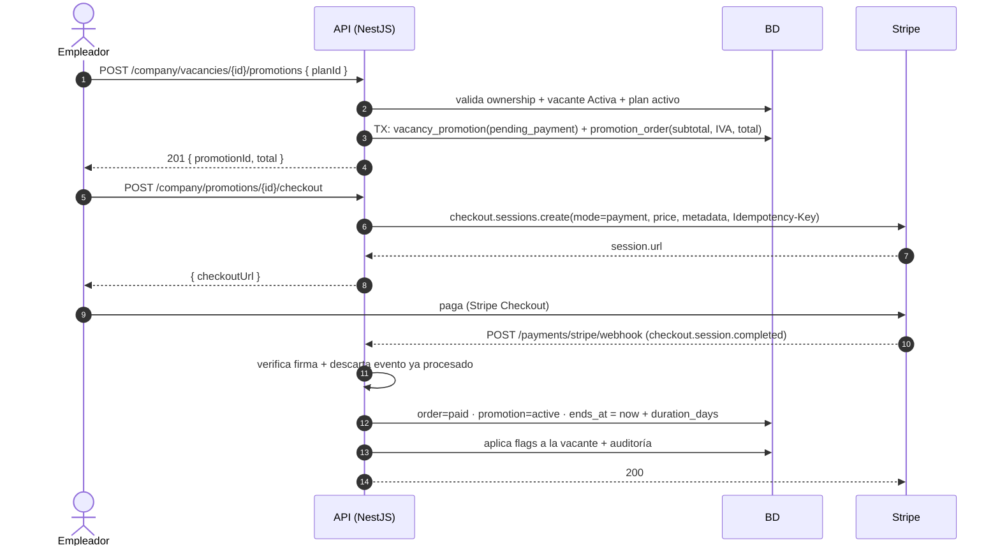
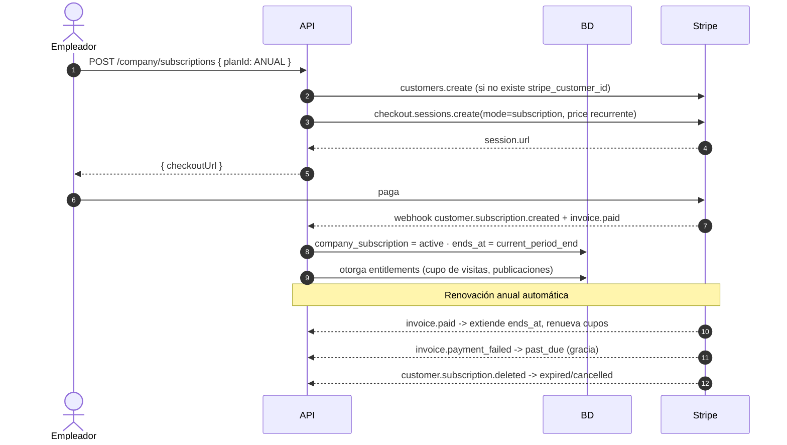

# Impulso Jobs — Integración de pagos con Stripe

> Diseño de la pasarela para el módulo de billing (M14). Cubre los **dos modelos de cobro** del catálogo: pago único **por publicación** (Media / Alta) y **suscripción anual** de empresa (Anual).

> 🕓 **Estado (agosto 2026): sin implementar.** No hay dependencia de Stripe en `backend/package.json`, ni `modules/billing/`, ni las variables de §8 en `.env.example`, ni tablas `promotion_orders` / `company_subscriptions` / `processed_stripe_events`. Este documento es el plan a ejecutar, no una descripción del código.
> Antes de empezar hacen falta la **entidad legal** para operar Stripe en México, el **PAC** para el CFDI y los **precios en MXN** (ver `README_CONTEXTO.md`).

---

## 0. Contexto: Stripe en México ✅

La plataforma opera en **México**, donde **Stripe está disponible oficialmente**. No se requiere entidad en el extranjero, y se habilitan métodos de pago locales clave:

| Método | Uso | Nota importante |
|---|---|---|
| **Tarjetas** | Todos los planes | Débito y crédito. |
| **OXXO** (efectivo) | **Solo pagos únicos** (Media/Alta) | +30 % de las transacciones en México. **No admite suscripciones.** Mín. MXN 10 · **máx. MXN 10,000**. Pago **diferido** (confirma al siguiente día hábil). Sin reembolsos ni disputas. |
| **SPEI** (transferencia) | Todos los planes | Ideal B2B y montos altos. Stripe da una CLABE virtual con conciliación automática. |
| **Meses Sin Intereses (MSI)** | Tickets altos (Alta / Anual) | Hasta 24 cuotas. Requiere MXN y tarjeta mexicana. Tiene **costo adicional** sobre la comisión. |

**Moneda:** MXN · **IVA:** 16 % · **Facturación:** el **CFDI (SAT)** lo emite un **PAC**, *no* Stripe (ver documento de localización).

> **Consecuencia de diseño #1:** el plan **Anual** (suscripción recurrente) **no puede cobrarse con OXXO**. Solo tarjeta, SPEI o MSI.
> **Consecuencia de diseño #2:** OXXO y SPEI son **pagos asíncronos** — ver §4.

## 1. Mapeo de conceptos: Impulso Jobs ↔ Stripe

| Impulso Jobs | Stripe | Nota |
|---|---|---|
| `companies` (empresa) | **Customer** | Guardar `stripe_customer_id` en `companies`. Se crea una sola vez. |
| `plans` (Media / Alta / Anual) | **Product** | Un Product por plan. |
| Precio del plan | **Price** | Media/Alta → `one_time`. Anual → `recurring { interval: year }`. |
| Compra de promoción (Media/Alta) | **Checkout Session** `mode: "payment"` | Pago único ligado a una vacante. |
| Suscripción anual | **Checkout Session** `mode: "subscription"` | Genera una **Subscription** de Stripe. |
| `promotion_orders` | **PaymentIntent / Invoice** | Guardar `external_reference` = id de Stripe. |
| `vacancy_promotions` | — (estado propio) | Se activa al confirmar el pago vía webhook. |
| `company_subscriptions` | **Subscription** | Guardar `stripe_subscription_id`; el ciclo lo dicta Stripe. |
| Gestionar/cancelar suscripción | **Billing Portal** | Evita construir UI de gestión de tarjeta. |

**Fuente de verdad de los precios:** el catálogo interno (`plans`) manda para *mostrar* y para reglas de negocio; el **Price de Stripe** manda para *cobrar*. Guarda `stripe_product_id` y `stripe_price_id` en `plans` para que no se desincronicen. Al cambiar un precio se crea un **Price nuevo** (los Price de Stripe son inmutables) y se actualiza el plan.

---

## 2. Flujo A — Pago único por publicación (Media / Alta)



**Puntos clave**
- `metadata` en la sesión: `{ promotionId, orderId, companyId, vacancyId, planCode }` → así el webhook sabe qué activar sin adivinar.
- `client_reference_id` = `orderId` (facilita conciliación).
- **Idempotency-Key** en la llamada a Stripe (usa el `orderId`): si el usuario hace doble clic, no se crean dos sesiones.
- `success_url` / `cancel_url` apuntan al front (`/empresa/vacantes/{id}?pago=ok`).

---

## 3. Flujo B — Suscripción anual (plan Anual)



**Puntos clave**
- El **ciclo de vida lo dicta Stripe**: no calcules tú la fecha de renovación; sincroniza `ends_at` con `current_period_end` de la Subscription en cada `invoice.paid`.
- **Renovación de cupos:** al renovar el período, reinicia el cupo de visitas a la base de talento (nuevo `talent_access_grant`).
- **Pago fallido:** define política de gracia (`past_due`) antes de suspender los beneficios.
- **Billing Portal** (`billingPortal.sessions.create`) para que la empresa cambie tarjeta o cancele, sin construir esa UI.

---

## 4. Webhooks a manejar

| Evento | Acción |
|---|---|
| `checkout.session.completed` | **Tarjeta:** activar promoción y marcar order `paid`. **OXXO/SPEI:** ⚠️ **NO está pagado** — solo se generó el vale. Guardar referencia y pasar la orden a `awaiting_payment`. |
| `checkout.session.async_payment_succeeded` | **OXXO/SPEI:** el pago se confirmó → activar `vacancy_promotion` y marcar order `paid`. |
| `checkout.session.async_payment_failed` | **OXXO/SPEI:** el vale venció o el pago falló → cancelar la orden. |
| `payment_intent.payment_failed` | Marcar order `failed`; la promoción sigue `pending_payment`. |
| `checkout.session.expired` | Cancelar la orden y liberar la promoción pendiente. |
| `customer.subscription.created` | Crear/activar `company_subscription` + entitlements. |
| `customer.subscription.updated` | Sincronizar estado y `current_period_end`. |
| `customer.subscription.deleted` | Expirar la suscripción y revocar beneficios. |
| `invoice.paid` | Renovar período + reiniciar cupos. |
| `invoice.payment_failed` | Estado `past_due`; notificar a la empresa. |
| `charge.refunded` | Revertir promoción/suscripción según política. |

**Reglas obligatorias del endpoint de webhook** (`POST /payments/stripe/webhook`):

1. **Verificar la firma** con `stripe.webhooks.constructEvent(rawBody, signature, endpointSecret)`. → En NestJS hay que habilitar el **raw body** para esa ruta (`rawBody: true` en `NestFactory.create` + excluirla del parser JSON), o la firma **siempre falla**.
2. **Idempotencia:** tabla `processed_stripe_events (event_id PK, type, processed_at)`. Si el `event.id` ya existe → responder `200` y no hacer nada. Stripe **reintenta** los eventos.
3. **Responder rápido** (`200`) y procesar lo pesado en background si hace falta; Stripe considera timeout > ~20s.
4. **Orden no garantizado:** los eventos pueden llegar desordenados. No asumas secuencia; haz cada handler *idempotente por estado final*.
5. La ruta del webhook va **sin `JwtAuthGuard`** (la autentica la firma), y **fuera** del guard global si lo hay.

---

## 5. Cambios en el modelo de datos

```text
companies
  + stripe_customer_id            (text, nullable, unique)

plans
  + stripe_product_id             (text)
  + stripe_price_id               (text)   -- Price vigente (inmutable en Stripe)
  + plan_type                     (per_publication | annual_subscription)
  + billing_period                (one_time | annual)

promotion_orders
  + provider                      ('stripe')
  + external_reference            (checkout session id / payment intent id)
  + stripe_invoice_id             (nullable, para suscripción)

company_subscriptions            (nueva)
  id, company_id, plan_id, stripe_subscription_id,
  status (pending_payment|active|past_due|cancelled|expired),
  current_period_end, auto_renew, created_at, updated_at

processed_stripe_events          (nueva — idempotencia)
  event_id (PK), type, processed_at
```

---

## 6. Implementación en la estructura del backend

Respetando `AGENTS.md` (módulo `modules/billing/`):

```text
modules/billing/
├─ controllers/
│  ├─ plans.controller.ts              # GET /plans (público) · /admin/plans (ADMIN)
│  ├─ promotions.controller.ts         # compra + checkout (EMPLOYER)
│  ├─ subscriptions.controller.ts      # suscripción anual (EMPLOYER)
│  └─ stripe-webhook.controller.ts     # POST /payments/stripe/webhook  (sin guard, raw body)
├─ services/
│  ├─ payment-provider.port.ts         # INTERFAZ (el dominio depende de esto, no de Stripe)
│  ├─ stripe-payment.adapter.ts        # implementación con la SDK de Stripe
│  ├─ pricing.service.ts               # subtotal + IVA + total
│  └─ entitlement.service.ts           # cupos (visitas a base de talento)
├─ use-cases/
│  ├─ create-vacancy-promotion.use-case.ts
│  ├─ start-checkout.use-case.ts
│  ├─ handle-stripe-event.use-case.ts        # despacha por tipo de evento (idempotente)
│  ├─ create-company-subscription.use-case.ts
│  ├─ expire-promotions.use-case.ts          # cron
│  └─ reconcile-pending-orders.use-case.ts   # cron: consulta a Stripe si el webhook no llegó
├─ entities/ · repositories/ · dto/
└─ billing.module.ts
```

**El puerto** (lo que ve el dominio; Stripe queda encapsulado):
```ts
export interface PaymentProvider {
  ensureCustomer(companyId: string, email: string): Promise<string>;      // -> customerId
  createOneTimeCheckout(input: OneTimeCheckoutInput): Promise<{ url: string; reference: string }>;
  createSubscriptionCheckout(input: SubscriptionCheckoutInput): Promise<{ url: string; reference: string }>;
  createBillingPortalSession(customerId: string, returnUrl: string): Promise<{ url: string }>;
  verifyWebhook(rawBody: Buffer, signature: string): PaymentEvent;        // firma + parseo
  getPaymentStatus(reference: string): Promise<PaymentStatus>;            // para el reconciliador
}
export const PAYMENT_PROVIDER = Symbol('PAYMENT_PROVIDER');   // token de DI
```

---

## 7. Gotchas de Stripe (los que suelen costar tiempo)

- **Montos en la unidad mínima.** MXN **no** es moneda de cero decimales: los importes van en **centavos** (`unit_amount = pesos * 100`). Un error aquí cobra 100× de más o de menos.
- **Raw body en el webhook** (ver §4.1). Es la causa #1 de "signature verification failed".
- **Los Price son inmutables.** Cambiar el precio de un plan = crear un Price nuevo y actualizar `stripe_price_id`. No rompas las suscripciones vigentes.
- **Nunca confíes en el `success_url`** para activar la promoción: el usuario puede cerrar el navegador. **La activación la hace el webhook**, siempre. Y con **OXXO ni siquiera ha pagado todavía** al volver del checkout.
- **Idempotency-Key** en toda llamada de escritura hacia Stripe.
- **Reconciliador obligatorio:** un cron que, para toda orden `pending_payment` con más de X minutos, consulte el estado en Stripe (`getPaymentStatus`) y cierre el caso. Los webhooks se pierden.
- **IVA (16 %):** o lo calculas tú o usas **Stripe Tax**. Decide uno; no mezcles. La **facturación CFDI ante el SAT es aparte** y requiere un PAC.
- **Modo test:** claves `sk_test_…`, tarjetas de prueba (`4242 4242 4242 4242`), y **Stripe CLI** (`stripe listen --forward-to localhost:3000/payments/stripe/webhook`) para probar webhooks en local.
- **Secretos:** `STRIPE_SECRET_KEY` y `STRIPE_WEBHOOK_SECRET` solo en el backend (`.env`). El frontend nunca los ve; solo recibe la `checkoutUrl`.

---

## 8. Variables de entorno

```bash
STRIPE_SECRET_KEY=sk_test_...
STRIPE_WEBHOOK_SECRET=whsec_...
STRIPE_CURRENCY=mxn
APP_TAX_RATE=0.16                 # IVA México, si lo calculas tú
OXXO_VOUCHER_EXPIRES_DAYS=3
CHECKOUT_SUCCESS_URL=https://app.impulsojobs.com/empresa/vacantes/{id}?pago=ok
CHECKOUT_CANCEL_URL=https://app.impulsojobs.com/empresa/planes?pago=cancelado
```

## 9. Impacto en el backlog

La tarea **T‑224 "PaymentProvider port + adaptador"** pasa a ser específica de Stripe y se amplía:

| Tarea | Descripción | Est. |
|---|---|---|
| T‑224a | Puerto `PaymentProvider` + adaptador Stripe (customers, checkout único y de suscripción, billing portal) | 10 h |
| T‑224b | Endpoint de webhook: raw body, verificación de firma, tabla de idempotencia | 6 h |
| T‑224c | Sincronización de planes ↔ Products/Prices de Stripe (seed + actualización) | 5 h |
| T‑225b | Flujo de **suscripción anual** (`company_subscriptions` + entitlements + renovación) | 12 h |
| T‑226b | Cron **reconciliador** de órdenes pendientes | 4 h |

> Suma ~**37 h adicionales** sobre la estimación previa de billing, principalmente por la suscripción anual (que antes no existía) y el manejo correcto de webhooks.

## 10. Decisiones pendientes

1. **Precios en MXN.** ⚠️ Si **Alta** supera **$10,000 MXN**, no podrá pagarse con **OXXO** (límite del vale).
2. **¿Se habilita OXXO?** (recomendado: sí — más del 30 % de las transacciones en México).
3. **¿Meses Sin Intereses** en Alta/Anual? Sube conversión, pero agrega costo a la comisión.
4. **IVA (16 %):** ¿cálculo propio o Stripe Tax? ¿Precio mostrado con IVA incluido o "+ IVA"?
5. **PAC para el CFDI** (Facturama, Facturapi, SW…): ¿cuál y facturación automática o a solicitud?
6. **Política de fallo de pago** en la suscripción anual: días de gracia antes de suspender beneficios.
7. **Upgrade Media → Alta:** ¿se permite? ¿con prorrateo?
